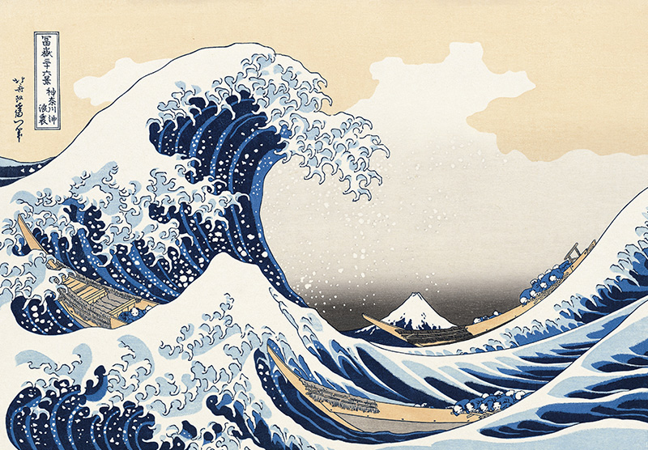
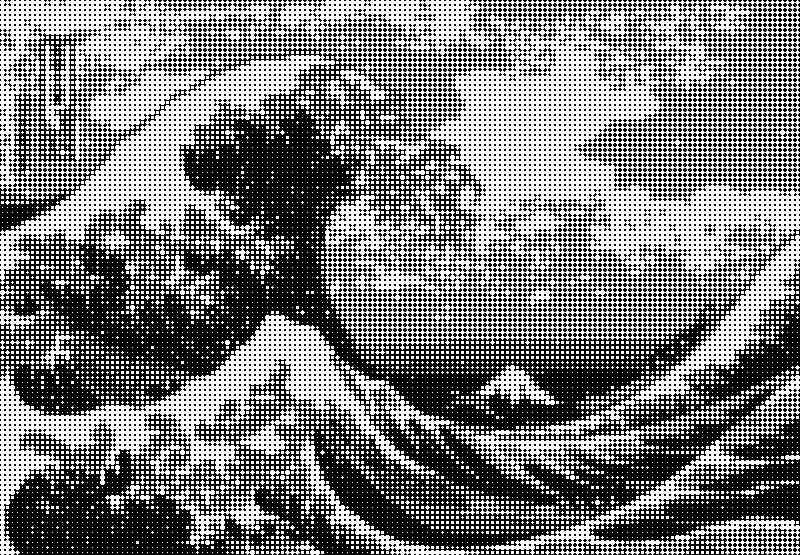
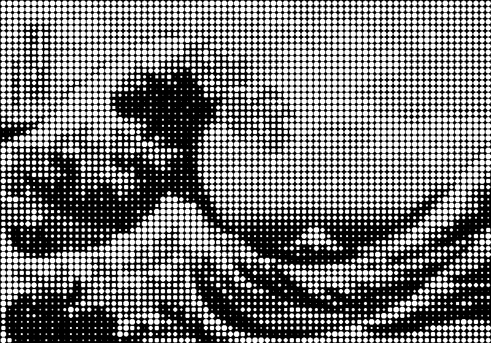
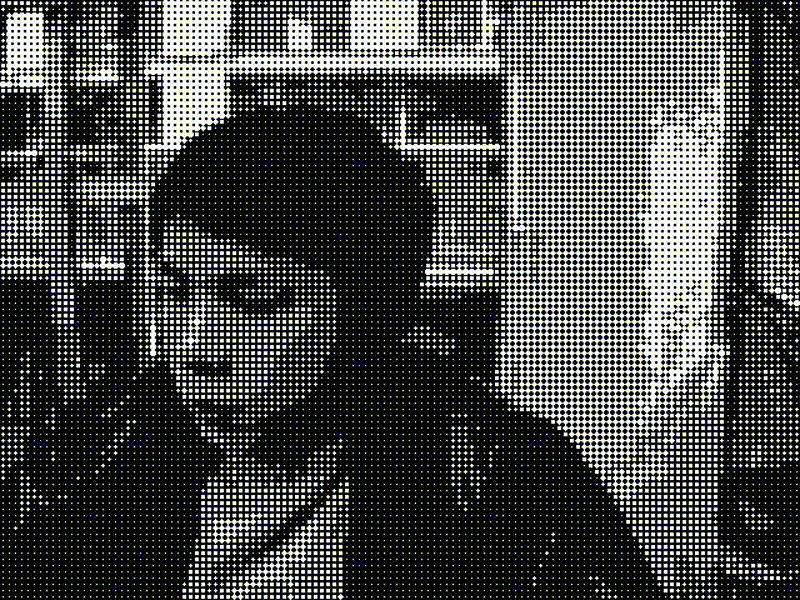

# Artistic Circle Effect Generator

A powerful image and video processing tool that transforms visual content into an artistic stippling effect using dynamically sized white circles on a black background. This application processes images, videos, and live webcam input to create unique artistic renderings where brightness values control the size of circles.

## Features

- **Multiple Input Types**: Process images, videos, or webcam input
- **High Performance**: Optimized for CPU with batch processing and vectorized operations
- **Resolution Control**: Automatically resizes large videos to Full HD (1920x1080) while preserving aspect ratio
- **Batch Processing**: Accelerates video processing by handling multiple frames simultaneously
- **Real-time Feedback**: Shows processing speed and progress information
- **Flexible Output**: Choose to save results or just view the processing
- **Command-line Interface**: Easy to use with customizable parameters

## Installation

### Prerequisites

- Python 3.7 or higher
- OpenCV
- NumPy

### Setup

1. Clone this repository:
```bash
git clone https://github.com/LeDat98/Circleartify
cd Circleartify
```

2. Install required packages:
```bash
pip install opencv-python numpy
```

## Usage

The application provides a simple command-line interface with various options:

```bash
python artistic_effect.py [input] [options]
```

### Basic Examples

Process an image:
```bash
python artistic_effect.py image.jpg
```

Process a video:
```bash
python artistic_effect.py video.mp4
```

Use webcam as input:
```bash
python artistic_effect.py webcam
```

### Advanced Examples

Process an image with a larger window size and display the result:
```bash
python artistic_effect.py image.jpg --window-size 10 --show=True
```

Process a video with custom settings:
```bash
python artistic_effect.py video.mp4 --window-size 8 --batch-size 15 --output processed_video.mp4
```

Process webcam feed without saving:
```bash
python artistic_effect.py webcam --save=False
```

### Available Options

| Option | Short | Default | Description |
|--------|-------|---------|-------------|
| `--output` | `-o` | Auto-generated | Output file path |
| `--window-size` | `-w` | 5 | Size of the processing window |
| `--batch-size` | `-b` | 10 | Number of frames to process at once (videos only) |
| `--save` | | True | Whether to save the output |
| `--show` | | False | Whether to display processing in real-time |

## How It Works

The algorithm divides the input image or video frame into small square regions (windows) of specified size. For each window:

1. It calculates the average brightness of pixels in that window
2. Based on this brightness value, it determines a circle radius (brighter regions get larger circles)
3. It draws a white circle at the center of each window with the calculated radius
4. The collection of these circles forms the final artistic rendering

The processing is optimized using NumPy's vectorized operations and OpenCV's efficient image processing capabilities.

## Performance Optimizations

- **Batch Processing**: Videos with high FPS are processed in batches to improve throughput
- **Resize Control**: Large videos are automatically resized to Full HD for efficient processing
- **Vectorized Operations**: Uses NumPy's vectorized calculations instead of nested loops where possible
- **Distance Matrix Calculation**: Pre-computes distance matrices once per window size for speed
- **Resize-based Average Calculation**: Uses OpenCV's resize function to quickly compute average brightness values

## Example Results

### Image Processing

**Original Image**  


**Processed (window_size=5)**  


**Processed (window_size=10)**  


### Webcam Processing

Below is an example of the webcam processing effect.

<!-- Another alternative using an animated GIF created from your video: -->


## License

This project is licensed under the MIT License - see the LICENSE file for details.

## Acknowledgments

- Inspired by traditional stippling art techniques
- Built with OpenCV and NumPy libraries
